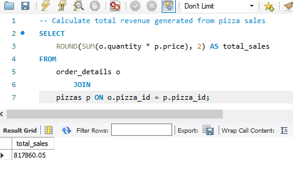
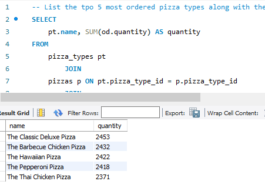
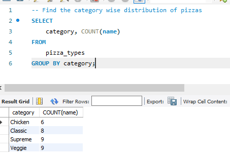
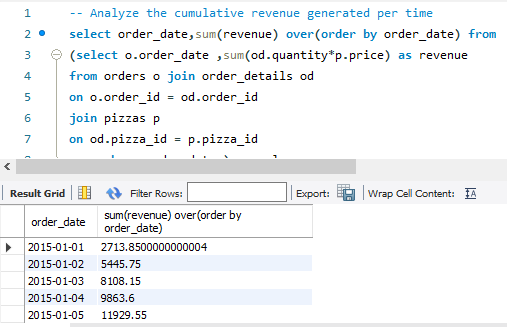

# 🍕 Pizza Sales SQL Project

## 📖 Project Overview

This project analyzes a pizza sales dataset using SQL to extract meaningful business insights. It focuses on revenue analysis, customer ordering patterns, product performance, and sales trends. The project demonstrates practical SQL skills by solving real-world business questions using joins, aggregate functions, Common Table Expressions (CTEs), subqueries, and window functions.

---

## 🎯 Objectives

- Analyze pizza sales data using SQL.
- Calculate total revenue generated from pizza sales.
- Identify best-selling pizzas and customer preferences.
- Analyze daily and hourly order trends.
- Generate meaningful business insights from sales data.

---

## 🛠️ Technologies Used

- MySQL
- MySQL Workbench
- Git
- GitHub

---

## 📂 Dataset

The analysis is performed using four relational tables:

| Table | Description |
|--------|-------------|
| 'orders' | Contains order ID, date, and time information. |
| 'order_details' | Contains pizza quantities ordered in each order. |
| 'pizzas' | Contains pizza size and price information. |
| 'pizza_types' | Contains pizza names, categories, and ingredients. |

---

## 🧠 SQL Concepts Used

- SELECT
- WHERE
- ORDER BY
- GROUP BY
- Aggregate Functions (`COUNT`, `SUM`, `AVG`)
- INNER JOIN
- Common Table Expressions (CTEs)
- Window Functions
- Subqueries
- LIMIT
- ROUND

---

## 📌 Business Questions Solved

1. Retrieve the total number of orders placed.
2. Calculate the total revenue generated from pizza sales.
3. Identify the highest-priced pizza.
4. Identify the most common pizza size ordered.
5. List the top 5 most ordered pizza types along with their quantities.
6. Calculate the total quantity of pizzas ordered.
7. Analyze the distribution of orders by hour.
8. Analyze the category-wise distribution of pizzas.
9. Calculate the average number of pizzas ordered per day.
10. Determine the top 3 pizza types based on revenue.
11. Calculate the percentage contribution of each pizza category to total revenue.
12. Analyze cumulative revenue generated over time.
13. Determine the top 3 most ordered pizza types based on revenue for each category.

---

## 📸 Sample Query Results

### 💰 Total Revenue Generated

---

### 🍕 Top 5 Most Ordered Pizzas

---

### 📊 Category-wise Pizza Distribution

---

### 📈 Cumulative Revenue Analysis

---

## 📈 Key Insights

- Calculated the total revenue generated from pizza sales.
- Identified the highest-priced pizza available on the menu.
- Determined the most frequently ordered pizza size.
- Ranked the top-performing pizzas based on order quantity and revenue.
- Analyzed category-wise revenue contribution to overall sales.
- Examined cumulative revenue trends using SQL window functions.
